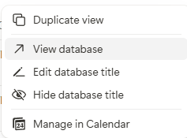
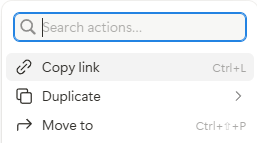

# IDEA2 💭


Expert-in-the-loop requirement elicitation and analysis for ontology engineering.

IDEA2 is a framework which defines workflows for enriching Ontology Engineering by leveraging state-of-the-art Large Language Models (LLMs) such as `Gemini`, and advancements in the fields of Knowledge Engineering and Ontology Engineering. It provides a system through which a team of engineers and domain experts can utilise LLMs to inform the creation and refinement of Ontologies through Competency Question (CQ) extraction and iterative refinement, which is semi-automated with an **expert(s)-in-the-loop** approach. 

With this framework, the user can select a specific model, hyperparameters and prompt configurations to extract CQs from a range of source documents, and in turn populate a Notion page with the results alongisde the associated provenance to allow for domain experts to validate these CQs, which fine-tunes the LLM's generations as iterations progress, in turn making the whole process more and more streamlined. A set of validated and correct CQs (with respect to the source schemas) are then yielded at the end of iterative refinement, which can be used to engineer the ontology and ensure it captures the domain requirements (e.g SPARQL queries).

# Overview
## Methodology ⚙️

IDEA2 remains flexible for different applications; ontology engineers may opt to use IDEA2 in order to make the requirements engineering process more efficient, to test their ontology, or to assist in engineering the ontology itself. This is done via **iterative refinement**.


*The IDEA2 Workflow*

IDEA2 was employed during the creation of the [`AnIML Ontology`](https://github.com/KE-UniLiv/animl-ontology), whereby the tool curated CQs which informed the creation of the ontology itself, and it's outputs were validated in 3 iterations by domain experts. This ensured that the resulting ontology effectively captured the relevant requirements of the [`AnIML schema`](https://www.animl.org/) which was the source documentation for the tool. IDEA2 has also been adaptable to the domain of cultural heritage, whereby it was tasked with improving a set of CQs (from human-annotators and LLMs in comparable proportions) which were derived from user stories and personas.

## Reformulations and iterative refinement ♻️
Reformulation of a CQ takes place when any given CQ has a score of $<= 0$ on the Notion database. If this occurs, **--find_rejected** will pull these and store them in [`rejected_cqs.json`](assets/cqs/rejected_cqs.json) and **--reformulate** will allow the reformulation of those rejected CQs. Should a comment be given to a rejected CQ (ie, a reason as to why it was rejected), this will be passed to the LLM as well. Through iterations of CQ generations and feedback, the LLM should become fine-tuned to the task as the **message history** is given to the LLM as context from `.json` chat history files.

**IMPORTANT**: Make sure that you select *no* when prompted if you have changed schemas since last run. This is to ensure you do not use too many tokens. A check will be done to see if the gemini_history.json contains any string related to the source schema. If this returns true and you say the schema has changed, the program will not continue as there is a discrepancy.

## Prompts 🗣️

Prompt engineering is at the core of this workflow and [`prompts.py`](idea2/prompts.py) defines the prompts that can be given to the model, typically we have:

- A role for the LLM to take (Requirements engineer, Ontology creator, Ontology tester)

- Examples of CQs for other domains (e.g [`Music Meta`](https://github.com/polifonia-project/music-meta-ontology))

- Instructions for the LLM (Extract all / assume ontology exists / reformulate rejected CQs)

## Notion integration 💾

The workflow contains Notion intgeration which allows for domain experts to reject generated CQs and provide reasons for doing so. These rejected CQs are then fed back into the LLM, reformulated, and sent back to the Notion database. 

The **Notion page** is where the databases (CQ Pools and LLM configurations) are stored. To use the workflow, the Notion key in [`api_config.yml`](idea2/api_config.yml) must be the **key of an integration** in the workspace you are using. If you do not have such an integration in your workspace and page, please create one and add it to the appropriate page. Ensure this integration also has the appropriate permissions.

All in all, the Notion integration allows for:
- Saving of LLM configurations (provenance information, such as temperature, model and role)
- Saving of extracted and reformulated CQs (storage in CQ Pool)
- Acceptance or rejection of CQs (downvote, upvote)
- Priority labelling (Low, medium, high)
- Commenting of CQs (comment thread to be given as feedback to the LLM)
- Reformulates relation (link reformulation to the original CQ)

### Adding a Notion integration 🤖
The workflow requires an **Internal** Notion integration. To do this, please navigate to the [`Notion integration website`](https://www.notion.so/profile/integrations/) and create an internal integration under **Build**.
Ensure that the integration has the relevant read and write permissions, and invite it to the page where you are using IDEA2.


### Getting a Notion Database / Page ID
To get a database's key, hover around the title of the database in bold text, and click the 3 dots to reveal the drop down menu with the *View database* option:



From this, a new view of the database will be shown; again, click the three dots at the **top right** and click *copy link*:



From this a large URL will be copied, everything between the last backslash (/) and the "?v=" of the url is the database ID, it should be 32 characters long.

To get the page ID, follow the same process by clicking the triple dot selector at the top right of the page, and click *copy link* again. The ID is in the same two areas. Two examples for a database and a workspace page are given below:

`https://www.notion.so/xxxxxxx?v=yyyyyyyy&source=copy_link` (page)
`https://www.notion.so/xxxxxx...?source=copy_link` (database)

Only copy the *xxxxx...* values to get the ID for the [`api_config.yml`](idea2/api_config.yml).

### Notion Template 🏗️

We provide a [`Notion template`](https://keuniliv.notion.site/idea2-v1-template) that you can duplicate and use for your project at the following url: https://keuniliv.notion.site/idea2-v1-template. 

## Prepare data 📝

To start using IDEA2, the following must be provided in the appropriate area in [`api_config.yml`](idea2/api_config.yml):

```
gemini:
  key: <your gemini api key>

notionkey:
  key: <your notion integration key>

notionpage:
  key: <your Notion page's key>

notiondb:
  key: <your notion CQ Pool database key>

notionllmdb:
  key: <your notion LLM config database key>
```

Please note that the huggingface model **all-mpnet-base-v2** is used for similarity checking in iteration 1 (CQ extraction). 
This will remove CQs that are very similar to each other and hence redundant, but is optional. 
If you would like you use this feature, please ensure you are logged into huggingface through the huggingface-cli with your token, otherwise an error may be thrown after you have used tokens. 
A check is implemented for this purpose and may throw an exception when you run the code if you decide to use the **similarity model** without a valid token. The `--nosim` flag may be used to avoid using the model if this is not desired (shown in usage)

### Source documents 📂

All source documents for extraction are kept in the [`assets`](assets/) folder. You may import new files to this area either by doing so manually, or by running `idea2/runner.py --imports` which spawns two file explorer dialogs for you to select files and select the appropriate destination within [`assets`](assets/).

When running IDEA2 for the extraction phase, you will be prompted to select the files you want to use in a given folder within [`assets`](/assets/) via a [`questionary`](https://pypi.org/project/questionary/) prompt.
Subsequent iterations will detect which source you selected and continue with that context.

### Personas and User Stories 🤵
Personas and user stories are natural language formats for expressing requirements of a system. Personas and user stories may be passed to the LLM in `markdown` format (.md). This works similarly to the Schemas and XML sources to generate new competency questions based on what is expressed within those documents.

### Schemas and XML Definitions 📜

Schemas are used to inform the creation of the ontology due to the fact that the ontology should be able to answer the (verified) CQs generated from them. An example of schemas is the [`AnIML Schema (Core & Technique)`](https://www.animl.org/) which contains both a [`technique schema`](assets/schema/animl-technique.xsd) and a [`core schema`](assets/schema/animl-core.xsd). Given these two schemas as part of a prompt, the LLM will extract CQs relevant to the schema which can be used to inform the creation of an ontology or to see if an existing ontology can answer certain CQs.


## CQ Exports with JSON-LD 🚚💨
All CQs (or a subset) are exportable to JSON-LD format which utilises the owlunit vocabulary for denoting the concept of "CompetencyQuestion". It also utilises the PROV-O and schema.org schemas, and the Croissant data model. The LD is contextualised at the start of each export file. An example for the CQ *What conservation treatments has an item undergone* is given below:
  ```
      {
        "@type": "CompetencyQuestion",
        "@id": "ec76e8a6d114118f55047f6c26a3a59f289e89e34e9278ae2ce55db015d626af",
        "text": "What conservation treatments has an item undergone?",
        "source_file": "g01_cqs.jsonld",
        "hash": "ec76e8a6d114118f55047f6c26a3a59f289e89e34e9278ae2ce55db015d626af",
        "iteration": "g01_cqs",
        "model": "models/gemini-2.5-pro",
        "temperature": 0.8,
        "wasGeneratedBy": {
          "@type": "Activity",
          "name": "CQ Generation",
          "wasAttributedTo": {
            "@type": "SoftwareAgent",
            "name": "models/gemini-2.5-pro"
          }
        },
        "generatedAtTime": "2025-12-04T18:20:39.478806"
      }
```
*A full showcase of the preamble with the definition of the concept of CompetencyQuestion is made available when running exports.py for your data*

## Requirements and environments✅

Please find the requirements in [`requirements.txt`](requirements.txt). It is advised to create a virtual environment (conda or venv) to install the requirements such that it does not corrupt any of your other projects.

To easily install all of these requirements into an appropriate environment, please run 

``` 
pip install -r requirements.txt
```

## Usage ⚒️

When all the data is in place and the dependencies are installed, below is an example of how to utilise the workflow:

1.  Open a terminal and cd to your local instance of the source (e.g `C:/GitHub/IDEA2`)
2. Run `python idea2/runner.py` and set your API keys and source documents
3. Run a first iteration of CQ extractions
4.  Once evaluation is undertaken, run `python idea2/runner.py --model {your desired model} --temperature {Your desired temperature} --pull_rejected --reformulate --save --notion`
5. Repeat step 4 until no further CQs are needing reformulation.


Below are the supported arguments, please run `python idea2/runner.py --usage_help` if the default help given is not useful for you, or if things are still unclear.

```
usage: runner.py [-h] [--model MODEL] [--temperature TEMPERATURE] [--role ROLE] [--instruction INSTRUCTION]
                 [--example EXAMPLE] [--generation GENERATION] [--update_key UPDATE_KEY] [--nosim] [--imports]
                 [--reformulate_from_first_set] [--save] [--nolimit] [--nosimilarity] [--notion] [--reformulate]
                 [--find_rejected] [--find_accepted] [--usage_help] [--show_prompt] [--show_services] [--archive]
                 [--calculate_agreement]

Extract and store CQs using LLMs and Notion.

options:
  -h, --help            show this help message and exit
  --model MODEL         Model name (Options: models/gemini-2.5-flash, models/gemini-2.5-pro, models/gemini-1.5-flash-
                        latest, models/openai-gpt-4)
  --temperature TEMPERATURE
                        LLM temperature (Options: 0.0 to 1.0) (Default: 0.8)
  --role ROLE           Role for the LLM (Options: SYSTEM_ROLE_A, SYSTEM_ROLE_B, SYSTEM_ROLE_C)
  --instruction INSTRUCTION
                        Instruction for the LLM (Options: CQ_INSTRUCTION_A, CQ_INSTRUCTION_B, CQ_INSTRUCTION_C
  --example EXAMPLE     Give examples of CQs for the LLM (Options: CQ_EXAMPLE_A, CQ_EXAMPLE_B, CQ_EXAMPLE_C,
                        CQ_ACCEPTED_CQS)
  --generation GENERATION
                        Generation label (auto if not set manually)
  --update_key UPDATE_KEY
                        Update the API key in api_config.yml (input: <service>,<new key value>)
  --nosim               Skip similarity analysis (no Hugging Face authentication required)
  --imports             Select files to copy using a text-based interface
  --reformulate_from_first_set
                        Reformulate CQs when you already have some data stored. Start from iteration 2 without prior
                        context.
  --save                Save CQs to file (jsonld format)
  --nolimit             Remove the limit on number of CQs to extract
  --nosimilarity        Skip similarity analysis (no Hugging Face authentication required)
  --notion              Upload CQs to Notion
  --reformulate         Reformulate CQs using rejected CQs as input (Note: run with --find_rejected to find rejected
                        CQs first, then run with --reformulate to reformulate them)
  --find_rejected       Find rejected CQs in Notion and store (Note: run as the only argument ie python runner.py
                        --find_rejected)
  --find_accepted       Find accepted CQs in Notion and store/refresh (Note: Ideally run as the only argument ie
                        python runner.py --find_accepted)
  --usage_help          Show a more comprehensive help message with usage instructions
  --show_prompt         Show the prompts used for CQ extraction and reformulation
  --show_services       Show the available services in api_config.yml
  --archive             Archive all pages in the Notion database (use with caution, as this action is irreversible)
  --calculate_agreement
                        Calculate inter-rater agreement metrics (Cohen's Kappa and Krippendorff's Alpha)

```

### Common Usage Examples

#### Initial CQ Extraction (First Iteration)
Extract competency questions from source documents and save to both file and Notion:
```bash
python idea2/runner.py --model models/gemini-2.5-pro --temperature 0.8 --save --notion
```
**What this does:**
- Uses Gemini 2.5 Pro model
- Sets temperature to 0.8 for output creativity
- `--save`: Saves CQs to local JSON-LD files
- `--notion`: Uploads CQs to Notion database for expert review

#### CQ Reformulation (Subsequent Iterations)
After experts have reviewed and rejected some CQs, reformulate them based on feedback:
```bash
# Step 1: Pull rejected CQs from Notion
python idea2/runner.py --find_rejected

# Step 2: Reformulate rejected CQs and upload back to Notion
python idea2/runner.py --model models/gemini-2.5-pro --temperature 0.8 --reformulate --save --notion
```
**What this does:**
- `--find_rejected`: Retrieves CQs with score ≤ 0 and stores them locally
- `--reformulate`: Uses LLM to reformulate rejected CQs based on expert comments
- `--save` & `--notion`: Saves reformulated CQs locally and uploads to Notion

#### Skip Similarity Analysis (No Hugging Face Login Required)
If you don't want to use similarity checking:
```bash
python idea2/runner.py --model models/gemini-2.5-pro --temperature 0.8 --nosimilarity --save --notion
```

#### Extract Without Limits
Remove the default CQ extraction limit:
```bash
python idea2/runner.py --model models/gemini-2.5-pro --temperature 0.8 --nolimit --save --notion
```

## Citation

If you use IDEA2 in your work, please cite the following paper:

```bibtex
@inproceedings{watkissleek2026idea2,
  title={IDEA2: Expert-in-the-loop competency question elicitation for collaborative ontology engineering},
  author={Watkiss-Leek, Elliott and Alharbi, Reham and Rostron, Harry and Ng, Andrew and Johnson, Ewan and Mitchell, Andrew and Payne, Terry R. and Tamma, Valentina and de Berardinis, Jacopo},
  booktitle={Proceedings of the Workshop on LLM-driven Knowledge Graph and Ontology Engineering (LLMs4KGOE 2026) co-located with the 23rd European Semantic Web Conference (ESWC 2026)},
  year={2026},
  address={Dubrovnik, Croatia},
  month={May}
}
```