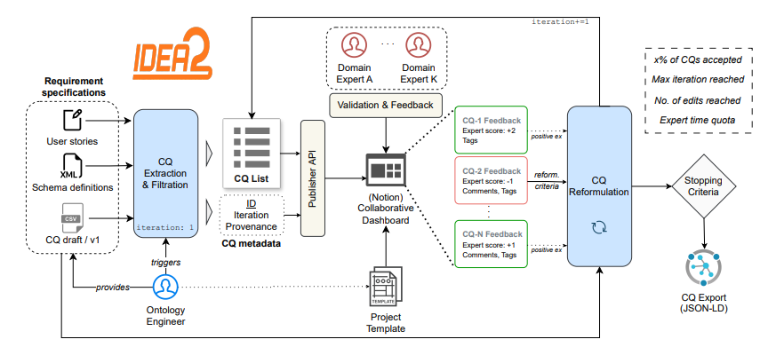

# IDEA2 💭


Expert-in-the-loop requirement elicitation and analysis for ontology engineering.

IDEA2 is a framework which defines workflows for enriching Ontology Engineering by leveraging state-of-the-art Large Language Models (LLMs) such as `Gemini`, and advancements in the fields of Knowledge Engineering and Ontology Engineering. It provides a system through which a team of engineers and domain experts can utilise LLMs to inform the creation and refinement of Ontologies through Competency Question (CQ) extraction and iterative refinement, which is semi-automated with an **expert(s)-in-the-loop** approach. 

With this framework, the user can select a specific model, hyperparameters and prompt configurations to extract CQs from a range of source documents, and in turn populate a Notion page with the results alongisde the associated provenance to allow for domain experts to validate these CQs, which fine-tunes the LLM's generations as iterations progress, in turn making the whole process more and more streamlined. A set of validated and correct CQs (with respect to the source schemas) are then yielded at the end of iterative refinement, which can be used to engineer the ontology and ensure it captures the domain requirements (e.g SPARQL queries).

# Overview
## Methodology ⚙️

IDEA2 remains flexible for different applications; ontology engineers may opt to use IDEA2 in order to make the requirements engineering process more efficient, to test their ontology, or to assist in engineering the ontology itself. This is done via **iterative refinement**.



*The IDEA2 Workflow*

IDEA2 was employed during the creation of the [`AnIML Ontology`](https://github.com/KE-UniLiv/animl-ontology), whereby the tool curated CQs which informed the creation of the ontology itself, and it's outputs were validated in 3 iterations by domain experts. This ensured that the resulting ontology effectively captured the relevant requirements of the [`AnIML schema`](https://www.animl.org/) which was the source documentation for the tool.

IDEA2 has also been adaptable to the domain of cultural heritage, whereby it was tasked with improving a set of CQs (from human-annotators and LLMs in comparable proportions) which were derived from user stories and personas.

RESULTS OF BME EXPERIMENT HERE

## Reformulations and iterative refinement ♻️
Reformulation of a CQ takes place when any given CQ has a score of $<= 0$ on the Notion database. If this occurs, **--find_rejected** will pull these and store them in [`rejected_cqs.json`](assets/cqs/rejected_cqs.json) and **--reformulate** will allow the reformulation of those rejected CQs. Should a comment be given to a rejected CQ (ie, a reason as to why it was rejected), this will be passed to the LLM as well. Through iterations of CQ generations and feedback, the LLM should become fine-tuned to the task as the **message history** is given to the LLM as context from `.json` chat history files.

**IMPORTANT**: Make sure that you select *no* when prompted if you have changed schemas since last run. This is to ensure you do not use too many tokens. A check will be done to see if the gemini_history.json contains any string related to the source schema. If this returns true and you say the schema has changed, the program will not continue as there is a discrepancy.

## Prompts 🗣️

Prompt engineering is at the core of this workflow and [`prompts.py`](idea2/prompts.py) defines the prompts that can be given to the model, typically we have:

- A role for the LLM to take (Requirements engineer, Ontology creator, Ontology tester)

- Examples of CQs for other domains ([`Music Meta`](https://github.com/polifonia-project/music-meta-ontology) etc)

- Instructions for the LLM (Extract all / assume ontology exists / reformulate rejected CQs)

## Notion integration 💾

The workflow contains Notion intgeration which allows for domain experts to reject generated CQs and provide reasons for doing so. These rejected CQs are then fed back into the LLM, reformulated, and sent back to the Notion database. 

The **Notion page** is where the databases (CQ Pools and LLM configurations) are stored. To use the workflow, the Notion key in [`api_config.yml`](idea2/api_config.yml) must be the **key of an integration** in the workspace you are using. If you do not have such an integration in your workspace and page, please create one and add it to the appropriate page. Ensure this integration also has the appropriate permissions.

All in all, the Notion integration allows for:
- Saving of LLM configurations (provenance information, such as temperature, model and role)
- Saving of extracted and reformulated CQs (storage in CQ Pool)
- Acceptance or rejection of CQs (downvote, upvote)
- Priority labelling (Low, medium, high)
- Commenting of CQs (comment thread to be given as feedback to the LLM)
- Reformulates relation (link reformulation to the original CQ)


### Getting a Notion Database's ID
To get a database's key, hover around the title of the database in bold text, and click the 3 dots to reveal the drop down menu with the *View database* option:


From this, a new view of the database will be shown; again, click the three dots at the **top right** and click *copy link*:


From this a large URL will be copied, everything between the last / and the ? of the url is the database ID, it should be 32 characters long.

## Prepare data 📝

To start using IDEA2, the following must be provided in the appropriate area in [`api_config.yml`](idea2/api_config.yml):

```
gemini:
  key: <your gemini api key>

notionkey:
  key: <your notion integration key>

notionpage:
  key: <your Notion page's key>

notiondb:
  key: <your notion CQ Pool database key>

notionllmdb:
  key: <your notion LLM config database key>
```

Schemas and XML definitions should be defined in [`assets/schema`](assets/schema) if you are using schemas as the source documents.

### Using source documents 📂

All source documents for extraction are kept in the [`assets`](assets/) folder. You may import new files to this area either by doing so manually, or by running `idea2/runner.py --imports` which spawns two file explorer dialogs for you to select files and select the appropriate destination within [`assets`](assets/).

When running IDEA2, you will be prompted to select the files you want to use in a given folder within [`assets`](/assets/) via a [`questionary`](https://pypi.org/project/questionary/) prompt.

### Personas and User Stories 🤵
Personas and user stories are natural language formats for expressing requirements of a system. Personas and user stories may be passed to the LLM in `markdown` format (.md). This works similarly to the Schemas and XML sources to generate new competency questions based on what is expressed within those documents.

### Schemas and XML Definitions 📜

Schemas are used to inform the creation of the ontology due to the fact that the ontology should be able to answer the (verified) CQs generated from them. An example of schemas is the [`AnIML Schema (Core & Technique)`](https://www.animl.org/) which contains both a [`technique schema`](assets/schema/animl-technique.xsd) and a [`core schema`](assets/schema/animl-core.xsd). Given these two schemas as part of a prompt, the LLM will extract CQs relevant to the schema which can be used to inform the creation of an ontology or to see if a former ontology can answer certain CQs. The schema is used in tandem with the prompt to attain powerful results for Ontology Engineering.


## LLMs and Hyperparameters 🤖

`Gemini` models are supported for the extraction of CQs from source documents. The temperature hyperparameter can be given to the model which relates to how creative the LLM is allowed to be in its response. The outputs for LLMs are given as both plain `.txt` files and `.jsonld` files, the former giving an easy way to quickly view a set of generated CQs, the latter allowing for more context and structure with **hash** fields, an example for the AnIML scenario would be:

```
[
  {
    "@context": "animl,
    "@type": "CompetencyQuestion",
    "@Generation": "g01_cqs",
    "@URI": "80479532f5433f8c314d8eb2567498ea6b5221377f255cf9c97e72785e4c2c4b",
    "@Reformulates": "None",
    "text": "What is the version of the AnIML document?",
    "identifier": "g01_cqs",
    "belongsToModel": {
      "@type": "System",
      "name": "models/gemini-2.5-pro",
      "temperature": 0.8,
      "roleset": "\nYou are an ontology engineer working on a project to develop a new ontology\nfor a domain of interest. You have been tasked with developing the ontology\nand ensuring that it is aligned with the requirements of the domain experts. \nYou will focus on requirement engineering."
    }
  }
]
```


*Please ensure that you have access to the model you require through your API key(s), or you may recieve errors.*


## Requirements and environments✅

Please find the requirements in [`requirements.txt`](requirements.txt). To easily install all of these requirements, run 

``` 
pip install -r requirements.txt
```

TODO, VIRTUAL ENV INSTRUCTIONS

## Usage ⚒️

When all the data is in place and the dependencies are installed, below is an example of how to utilise the workflow:

1.  Open a terminal and cd to your local instance of the source (e.g `C:/GitHub/IDEA2`)
2. Run `python idea2/runner.py` and set your API keys and source documents
3. Run a first iteration of CQ extractions
4.  Once evaluation is undertaken, run `python idea2/runner.py --model {your desired model} --temperature {Your desired temperature} --pull_rejected --reformulate --save --notion`
5. Repeat step 4 until no further CQs are needing reformulation.


Below are the supported arguments, please run `python idea2/runner.py --usage_help` if the default help given is not useful for you, or if things are still unclear.

```
usage: runner.py [-h] [--model MODEL] [--temperature TEMPERATURE] [--role ROLE] [--instruction INSTRUCTION]
                 [--example EXAMPLE] [--generation GENERATION] [--save] [--limit] [--notion] [--reformulate]
                 [--find_rejected] [--find_accepted] [--constrain] [--usage_help] [--show_prompt]

Extract and store CQs using LLMs and Notion.

options:
  -h, --help            show this help message and exit
  --model MODEL         Model name (Options: models/gemini-2.5-flash, models/gemini-2.5-pro, models/gemini-1.5-flash-
                        latest, models/openai-gpt-4)
  --temperature TEMPERATURE
                        LLM temperature (Options: 0.0 to 1.0) (Default: 0.2)
  --role ROLE           Role for the LLM (Options: SYSTEM_ROLE_A, SYSTEM_ROLE_B, SYSTEM_ROLE_C)
  --instruction INSTRUCTION
                        Instruction for the LLM (Options: CQ_INSTRUCTION_A, CQ_INSTRUCTION_B, CQ_INSTRUCTION_C)
  --example EXAMPLE     Give examples of CQs for the LLM (Options: CQ_EXAMPLE_A, CQ_EXAMPLE_B, CQ_EXAMPLE_C,
                        CQ_ACCEPTED_CQS)
  --generation GENERATION
                        Generation label (auto if not set manually)
  --save                Save CQs to file (jsonld format)
  --limit               Limit the number of CQs extracted (default: False) (note: must be called with --instruction)
  --notion              Upload CQs to Notion
  --reformulate         Reformulate CQs using rejected CQs as input (Note: run with --find_rejected to find rejected
                        CQs first, then run with --reformulate to reformulate them)
  --find_rejected       Find rejected CQs in Notion and store (Note: run as the only argument ie python runner.py
                        --find_rejected)
  --find_accepted       Find accepted CQs in Notion and store/refresh (Note: Ideally run as the only argument ie
                        python runner.py --find_accepted)
  --constrain           Use output constraints to validate the LLM output (default: False)
  --usage_help          Show a more comprehensive help message with usage instructions
  --show_prompt         Show the prompts used for CQ extraction and reformulation

```